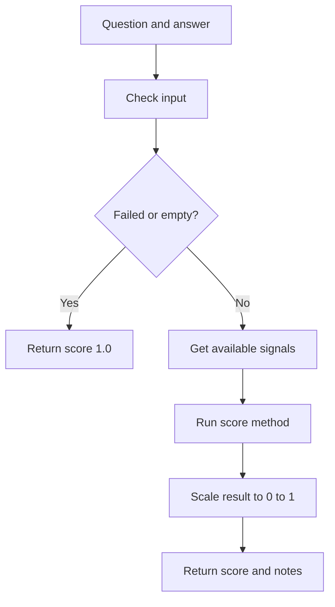

# Scorer flow

```mermaid
flowchart TD
    input["Question and answer"] --> check["Check input"]
    check --> failed{"Failed or empty?"}
    failed -->|Yes| penalty["Return score 1.0"]
    failed -->|No| features["Get available signals"]
    features --> method["Run score method"]
    method --> scale["Scale result to 0 to 1"]
    scale --> result["Return score and notes"]
```
