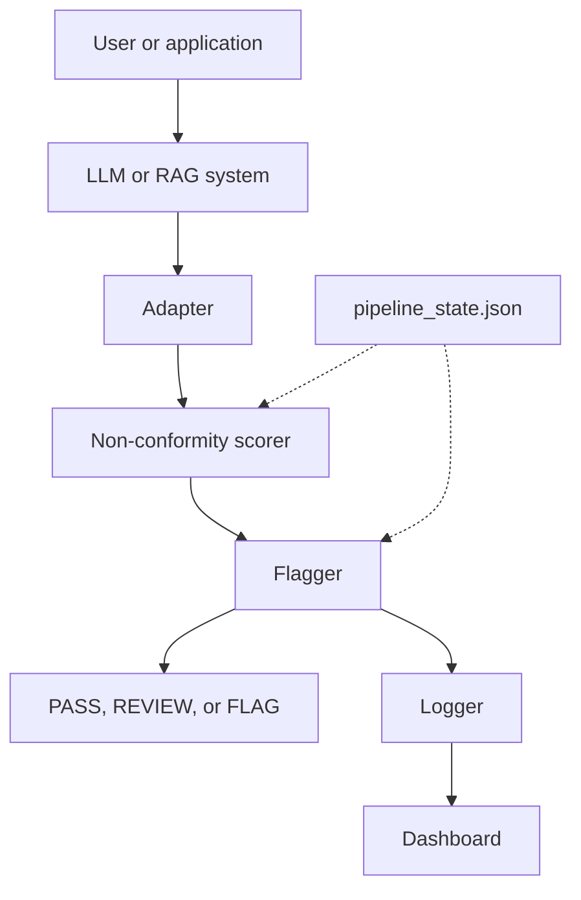

# System overview

```mermaid
flowchart TD
    app["User or application"] --> llm["LLM or RAG system"]
    llm --> adapter["Adapter"]
    adapter --> scorer["Non-conformity scorer"]
    scorer --> flagger["Flagger"]
    flagger --> route["PASS, REVIEW, or FLAG"]
    flagger --> logger["Logger"]
    logger --> dashboard["Dashboard"]
    state["pipeline_state.json"] -.-> scorer
    state -.-> flagger
```
